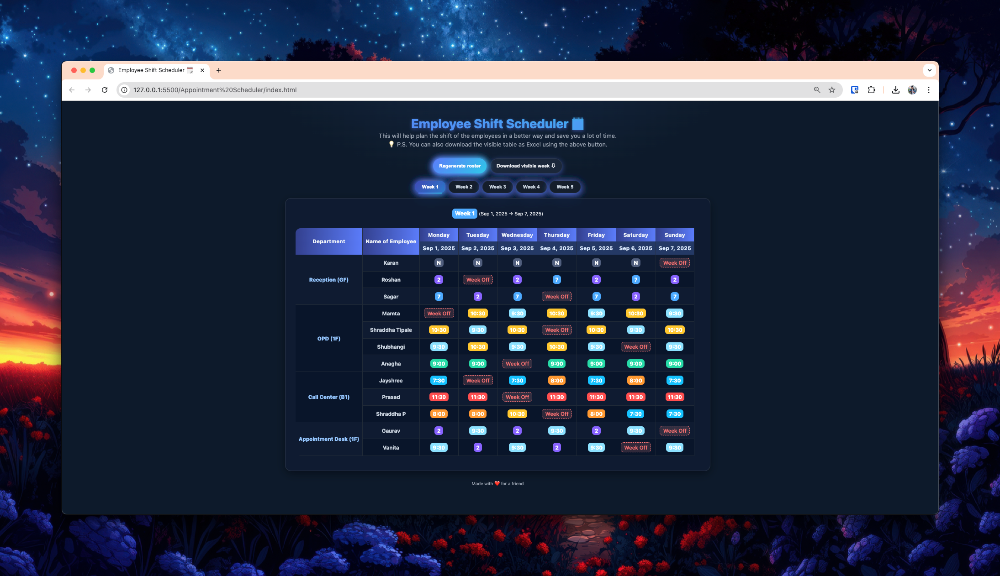
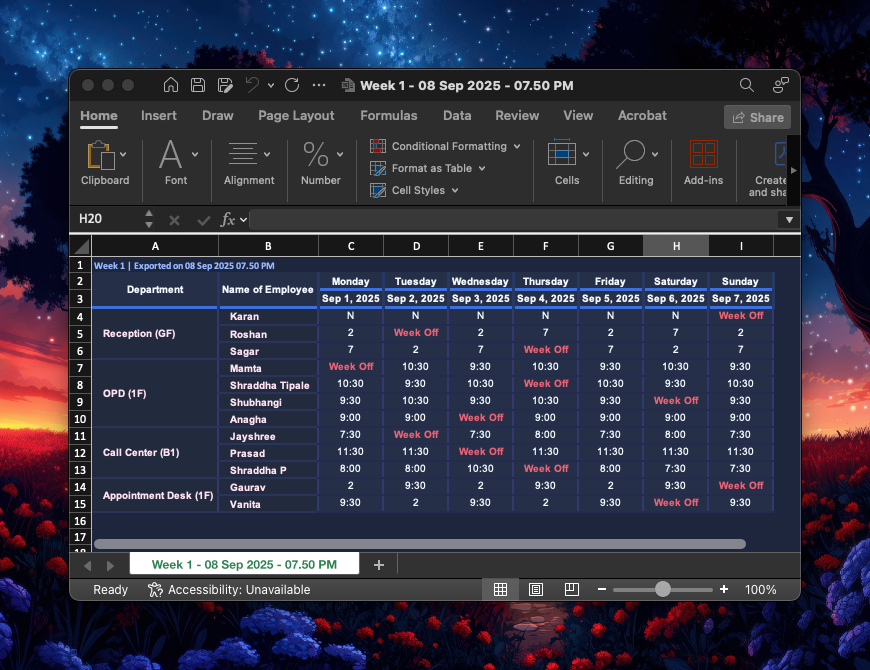

# 🗓️ Employee Weekly Shift Scheduler

A beautiful, interactive **weekly roster generator** built with **HTML, CSS, and JavaScript**.  
It automatically assigns shifts with rules, allows **week-by-week navigation**, and supports **Excel export**.

---

## 💡 Why I Built This?

A friend once told me how her manager spends hours every week preparing the shift roster manually.  
It wasn’t just a simple list – there were many rules to keep in mind:  
- Only a limited number of people can take leave on the same day  
- Departments can’t be understaffed  
- Some employees prefer specific timings  

Doing this by hand again and again was tiring, error-prone, and honestly unfair to her manager’s time.  

That’s when I thought – *why not create something small that can actually help?*  
A tool that looks modern, works quickly, and saves precious hours every week.  

This project isn’t about fancy tech – it’s about solving a real problem with a simple, thoughtful solution.  
If it makes someone’s work-life easier, even a little, then the effort was completely worth it ❤️  

---

## ✨ Features

- 🎲 **Auto-generate shifts** with random weekly swaps  
- 🗂️ **Tabbed weeks** (navigate easily)  
- 🎨 **Modern UI** with gradients, badges, and hover effects  
- 📥 **Download schedule to Excel**  
- ⚡ **Lightweight** – pure vanilla JS (no heavy frameworks)  

---

## 🚀 Demo

👉 Live Demo: (https://weekly-shift-scheduler.vercel.app)  

---

## 📂 Project Structure

```
📦 weekly-shift-scheduler
 ┣ 📜 index.html        # Main HTML
 ┣ 📜 logic.js          # Scheduling + Excel export
 ┣ 📜 styles.css        # Modern gradient styling
 ┣ 📂 docs/             # Assets like screenshots
    ┣ 📜 screenshot.png        # Main App Screenshot
    ┣ 📜 excel.png             # Exported Excel Screenshot
 ┗ 📜 README.md
```

---

## 🛠️ Installation & Usage

1. Clone the repository:

```bash
git clone https://github.com/yourusername/weekly-shift-scheduler.git
cd weekly-shift-scheduler
```

2. Open `index.html` in your browser. That’s it ✅

---

## 📤 Export Options

- `Download visible week ⇩`  
Exports the currently visible week to Excel with styled formatting.  

Supports:  
- **HTML → .xls** export (preserves CSS look)  

---

## 📸 Screenshots

### Main UI


### Excel Export


---

## 📜 License

This project is licensed under the **MIT License** – see the [LICENSE](LICENSE) file for details.
